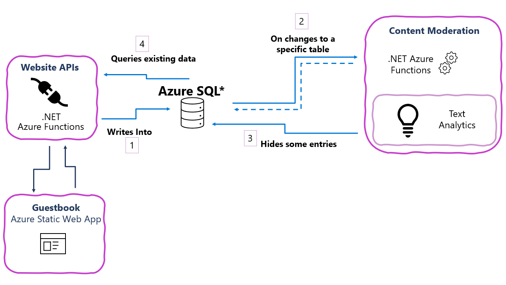

# SQL bindings guestbook demo

<!-- 
Guidelines on README format: https://review.docs.microsoft.com/help/onboard/admin/samples/concepts/readme-template?branch=master

Guidance on onboarding samples to docs.microsoft.com/samples: https://review.docs.microsoft.com/help/onboard/admin/samples/process/onboarding?branch=master

Taxonomies for products and languages: https://review.docs.microsoft.com/new-hope/information-architecture/metadata/taxonomies?branch=master
-->

A sample web application where users can leave a message and view recent messages.  After entry, messages are send to content moderation. Watch a walkthrough of this sample at [https://www.youtube.com/watch?v=01nhp4OAk0c](https://www.youtube.com/watch?v=01nhp4OAk0c).

## Components
- Azure SQL Database
- .NET Azure Functions
  - SQL trigger
  - SQL output binding
- JavaScript Azure Functions
  - SQL output binding
  - SQL input binding
- Azure Static Web App
 
## Contents

| File/folder       | Description                                |
|-------------------|--------------------------------------------|
| `.github/workflows`       | GitHub Actions workflows for the sample to deploy the Functions, the Azure Static Web App, and the SQL project. |
| `apis/js-api`            | JavaScript Azure Functions that serve the Azure Static Web App data. |
| `apis/net-api`           | .NET Azure Function that moderates new guestbook entries. |
| `apis/powershell-api`    | PowerShell Azure Function that runs a stored procedure to check the health of change tracking. |
| `guestbook`              | Azure Static Web App that serves the guestbook UI through a React app. |
| `sql`                    | SQL project that contains the database objects (tables, stored procedures). |
 
## Architecture

- [JavaScript Azure Functions](apis/js-api/)
  - lists some entries from the app.Entry table (SQL input binding)
  - add guestbook entry for to app.Entry table (SQL output binding)
- [Azure Static Web App](guestbook/)
  - input form for adding guestbook entries
  - list of guestbook entries
  - calls to the JavaScript Azure Functions
- [.NET Azure Function](apis/net-api/)
  - SQL trigger on changes in app.Entry table
  - sends newly inserted rows to Azure Content Moderation
  - SQL output binding writes moderation results to app.Moderation table
  - SQL output binding updates to app.Entry table
- [PowerShell Azure Function](apis/powershell-api/)
  - timer trigger runs the PowerShell functoion on a schedule
  - SQL input binding runs a stored procedure checking the health of change tracking

## What are SQL bindings?

Learn more at [https://aka.ms/sqlbindings](https://aka.ms/sqlbindings).

- Azure Functions can authenticate to Azure SQL Database with Azure AD Managed Identity
- Configure SQL bindings with a connection string and T-SQL query, stored procedure name, or table name
- SQL bindings are currently in preview for .NET, JavaScript, Python, PowerShell, and Java Azure Functions
- SQL trigger is currently in preview for .NET Azure Functions